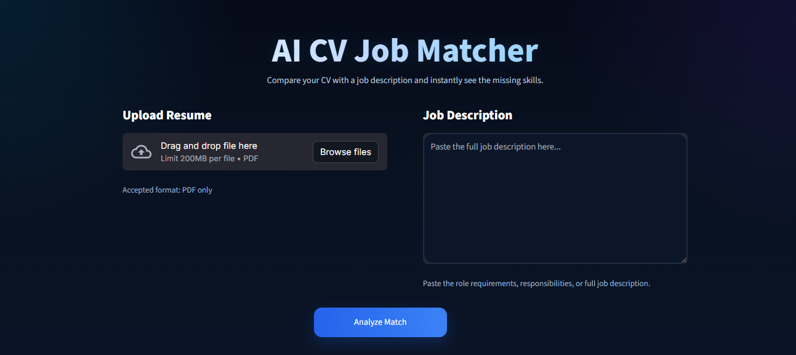
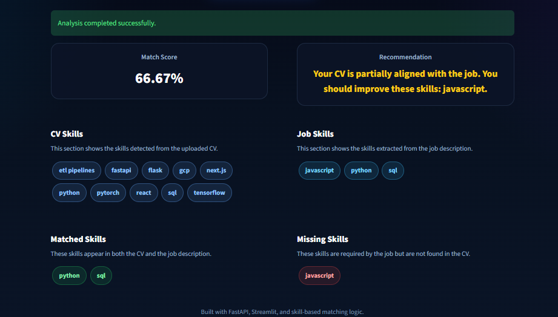

# AI CV Job Matcher

AI CV Job Matcher is a production-style AI-powered project that helps users compare their CV against a job description and instantly identify skill alignment and missing skills.

The system allows users to upload a resume in PDF format, extract and clean the text, detect CV skills, extract required job skills from a pasted job description, compare both skill sets, calculate a match score, and generate a recommendation.

---

## Project Goal

The goal of this project is to help users understand whether their CV is suitable for a specific job role by showing:

- skills detected from the uploaded CV
- skills extracted from the job description
- matched skills
- missing skills
- match score
- recommendation

This project is designed as a portfolio-ready application using FastAPI, Streamlit, and LangGraph.

---

## Screenshots

### Home Interface


### Analysis Result


---

## Features

- Upload CV in PDF format
- Extract text from PDF resumes
- Clean and normalize extracted text
- Extract skills from CV text
- Extract skills from job descriptions
- Detect missing skills
- Compute skill match score
- Generate recommendation
- Interactive Streamlit interface
- LangGraph workflow orchestration

---

## Tech Stack

### Backend
- Python
- FastAPI
- Pydantic
- LangGraph

### Frontend
- Streamlit

### PDF Processing
- pypdf

### Utilities
- regex-based skill extraction
- custom text cleaning
- job description preprocessing

---

## How It Works

The application follows this workflow:

1. User uploads a PDF resume
2. User pastes a job description
3. The system extracts text from the PDF
4. The text is cleaned and normalized
5. Skills are extracted from the CV
6. Skills are extracted from the job description
7. Both sets of skills are compared
8. The system calculates:
   - matched skills
   - missing skills
   - match score
9. A final recommendation is generated
10. Results are shown in the Streamlit interface

---

## LangGraph Workflow

The project uses LangGraph to organize the analysis workflow into explicit steps:

- clean CV text
- prepare job description
- extract CV skills
- extract job skills
- compare skills
- generate recommendation

This makes the project more modular, extensible, and closer to real AI workflow orchestration.

---

## Live Demo

- Frontend: YOUR_STREAMLIT_LINK
- Backend API: https://ai-cv-job-matcher-api.onrender.com
- API Docs: https://ai-cv-job-matcher-api.onrender.com/docs

---

## Project Structure

```text
ai-cv-job-matcher/
│
├── app/
│   ├── main.py
│   ├── config.py
│   │
│   ├── api/
│   │   ├── router.py
│   │   └── routes/
│   │       ├── health.py
│   │       ├── upload.py
│   │       ├── analysis.py
│   │       ├── match.py
│   │       └── final_analysis.py
│   │
│   ├── ai/
│   │   ├── state.py
│   │   └── graph.py
│   │
│   ├── core/
│   │   ├── exceptions.py
│   │   └── logger.py
│   │
│   ├── schemas/
│   │   ├── health.py
│   │   ├── upload.py
│   │   ├── analysis.py
│   │   ├── match.py
│   │   └── final_analysis.py
│   │
│   ├── services/
│   │   ├── file_service.py
│   │   ├── pdf_service.py
│   │   ├── text_cleaner.py
│   │   ├── job_text_processor.py
│   │   ├── skill_extractor.py
│   │   ├── matcher.py
│   │   └── recommender.py
│   │
│   └── utils/
│       └── skills_catalog.py
│
├── streamlit_app/
│   └── app.py
│
├── uploads/
├── requirements.txt
├── .env
└── README.mdس
